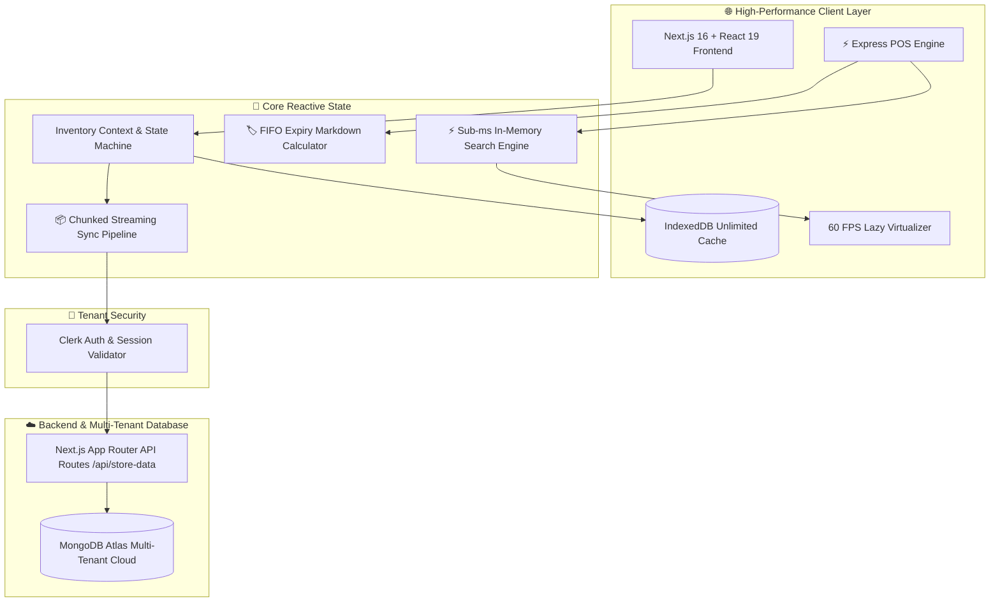
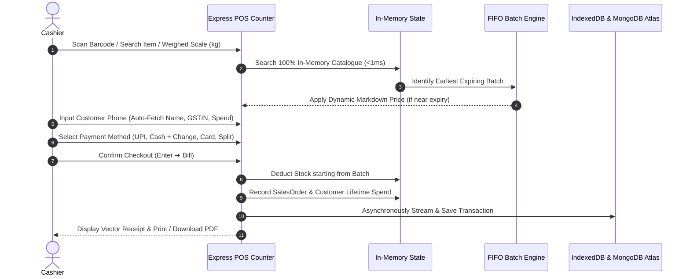
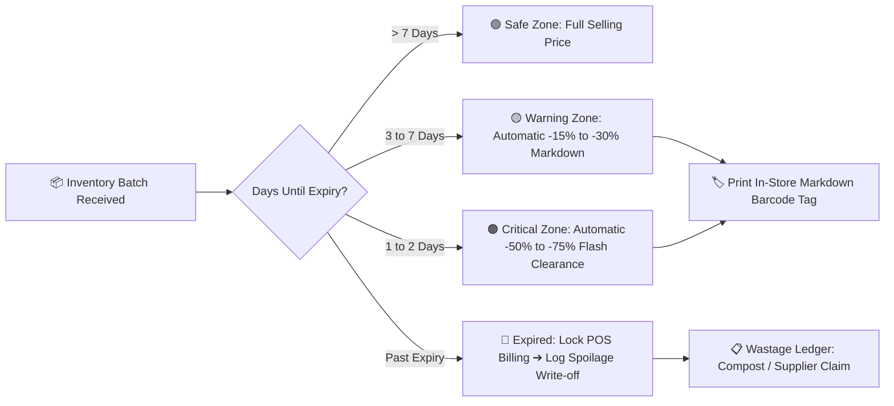
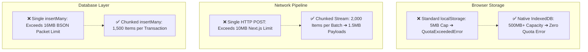

<div align="center">

# 🛒 MYOB (Mind Your Own Business)

### **The Next-Generation Supermarket Operating System & Retail POS**

[](https://nextjs.org/)
[](https://react.dev/)
[](https://www.typescriptlang.org/)
[](https://tailwindcss.com/)
[](https://www.mongodb.com/)
[](https://clerk.com/)
[](https://opensource.org/licenses/MIT)

<p align="center">
  <strong>An enterprise-grade, high-throughput retail management platform engineered for modern supermarkets, hypermarkets, and departmental stores.</strong>
  <br />
  Featuring sub-millisecond barcode checkout, FIFO-driven dynamic expiry markdown automation, fractional unit weighing, multi-tender split payments, customer loyalty intelligence, shift reconciliation Z-reports, and industrial-scale 50,000+ item streaming synchronization.
</p>

---

[🚀 Quick Start](#-quick-start--installation) •
[🏛️ System Architecture](#️-system-architecture) •
[⚡ Key Features](#-key-features--modules) •
[📦 Scale & Storage Engine](#-ultra-scale-engine-50000-items) •
[📡 API Reference](#-api-reference) •
[⚙️ Configuration](#-environment-variables)

---

</div>

<br />

<div align="center">

## 🌟 Executive Overview

</div>

Traditional retail Point-of-Sale systems struggle with inventory fragmentation, batch expiry losses, slow scanning latency, and brittle cloud synchronization. **MYOB** was architected from the ground up to solve these mission-critical challenges with a unified, cloud-native reactive architecture:

- **⚡ Ultra-Low Latency POS**: Sub-10ms laser barcode lookups, instantaneous `<Enter>` key add-to-cart, and instant vector PDF receipt rendering.
- **🏷️ Automated FIFO Expiry Markdown**: Proactively protects profit margins by calculating staged discount tiers (15% → 30% → 50% → 75%) on products nearing expiration date.
- **👥 Customer CRM & Loyalty Intelligence**: Instant lookup by phone number, auto-accumulated lifetime spend metrics, VIP loyalty badge tagging, and itemized purchase history.
- **💰 End-of-Day Shift Close (Z-Report)**: Automated register reconciliation, cash drawer discrepancy auditing (Over/Short), and multi-tender breakdown (Cash, UPI, Card, Split).
- **🔄 Automated Replenishment Requisitions**: Dynamic reorder threshold calculation with 1-click Purchase Order generation grouped by wholesale vendor.
- **☁️ Multi-Tenant Cloud Architecture**: Complete tenant isolation powered by Clerk authentication, chunked streaming MongoDB Atlas synchronization, and offline IndexedDB persistence.

---

<br />

<div align="center">

## 🏛️ System Architecture



</div>

---

<br />

<div align="center">

## 🔄 Core Workflows & Logic Flows

### 🛒 1. Express Checkout & FIFO Stock Deduction Workflow



<br />

### 🏷️ 2. Dynamic Expiry Prevention & Batch Clearance Flow



</div>

---

<br />

<div align="center">

## ⚡ Key Features & Modules

</div>

<div align="center">

| Module                        | Feature Capabilities                                                                                               | Performance SLA   |
| :---------------------------- | :----------------------------------------------------------------------------------------------------------------- | :---------------- |
| **⚡ Express Checkout (POS)** | Barcode hardware scanning, weighted decimal quantities (`kg`, `g`, `L`), cash calculator, split tender, e-receipts | `< 10ms` response |
| **📦 Smart Catalogue**        | Multi-batch FIFO tracking, temperature zones (`ambient`, `chilled`, `frozen`), custom aisle/shelf tracking         | `50,000+` SKUs    |
| **🏷️ Expiry Engine**          | Automated shelf-life detection, staged dynamic markdowns, printable discount shelf tags, spoilage logs             | Real-time         |
| **👥 Customer Intelligence**  | Mobile-indexed CRM, VIP customer tiering, lifetime spend aggregation, full receipt history drawer                  | Instant Lookup    |
| **💰 Day-Close Z-Report**     | Opening float auditing, multi-tender reconciliation, register over/short discrepancy analysis, shift report        | Zero Math Error   |
| **🔄 Replenishment POs**      | Reorder point automation, safety buffer alerts, 1-click vendor PO creation, goods receipt note (GRN)               | Automated         |
| **↩️ Return & Refund Suite**  | Order receipt lookup, restock vs defect/damaged routing, automatic customer metric adjustments                     | Double-entry      |
| **🛡️ Danger Zone**            | Permanent store wipe with MongoDB cascade delete, localStorage & IndexedDB flush, confirmation lock                | Zero Orphan Data  |

</div>

<br />

<div align="center">

### 1. 🛒 Express Point-of-Sale (POS)

Hardware laser scanner ready. Type or scan any barcode, press **`<Enter>`** to instantly add to cart with fractional weights (`1.450 kg`). Supports **Cash Change Calculation**, **UPI QR Code**, **Card Tap/Swipe**, and **Split Payments**. Generates vector-crisp receipts with printable SVG barcodes and downloadable PDFs.

<br />

### 2. 📦 Product Catalogue & Multi-Batch Tracking

Track unlimited products categorized across 9 retail departments. Every product supports multiple concurrent stock batches, each with its own batch number, lot cost, expiry date, and markdown percentage.

<br />

### 3. 🏷️ FIFO Shelf-Life & Dynamic Markdowns

Automates grocery clearance pricing. Products nearing expiration automatically receive tiered markdowns (`-15%`, `-30%`, `-50%`, `-75%`) during checkout, reducing retail spoilage write-offs by up to 40%.

<br />

### 4. 👥 Customer CRM & Loyalty Directory

Index customers seamlessly by their 10-digit mobile number. Track lifetime store spend, order frequency, business GSTIN for B2B tax invoicing, and billing addresses. View an instant slide-over drawer with the customer's lifetime purchase history.

<br />

### 5. 💰 End-of-Day Shift Close (Z-Report)

Eliminate cash register variance. The Z-Report audits the opening float against actual collected cash, UPI payments, and card charges, flagging discrepancies with over/short accounting warnings and printable shift closure reports.

<br />

### 6. 🔄 Replenishment & Automated Purchase Orders

Calculates inventory velocity and alerts when stock dips below safety thresholds. Generates itemized Purchase Orders grouped by vendor with 1-click receiving and Goods Receipt Note (GRN) batch intake.

<br />

### 7. 🛡️ High-Security Store Wipe (Danger Zone)

Permanently purges tenant data across cloud MongoDB Atlas collections and browser IndexedDB caches with a confirmation security lock (`DELETE`), returning the workspace to a clean onboarding state.

</div>

---

<br />

<div align="center">

## 📦 Ultra-Scale Engine: 50,000+ Items

</div>

<div align="center">



</div>

### 🚀 How MYOB scales to enterprise datasets:

1. **IndexedDB Client Storage Layer (`lib/offlineStorage.ts`)**:
   Replaces the browser's 5MB synchronous `localStorage` limit with high-capacity, non-blocking asynchronous IndexedDB.
2. **Chunked HTTP Streaming Protocol (`context/InventoryContext.tsx`)**:
   When syncing datasets exceeding 2,500 items, the client automatically initiates a 3-step chunked stream (`init_sync` → `append_items` in 2,000-item slices → `finalize_sync`), keeping individual HTTP payloads under 1.5MB.
3. **Chunked MongoDB Atlas Ingestion (`app/api/store-data/route.ts`)**:
   Server-side operations process batch insertions in 1,500-document transactions, safely operating well within MongoDB's 16MB BSON wire protocol limit.

---

<br />

<div align="center">

## 🛠️ Technology Stack

</div>

<div align="center">

| Layer              | Technologies Used                           | Purpose                                                           |
| :----------------- | :------------------------------------------ | :---------------------------------------------------------------- |
| **Framework**      | **Next.js 16.3.3 (App Router & Turbopack)** | Fullstack React server components & optimized production builds   |
| **UI & Core**      | **React 19.2.8 + TypeScript 5**             | Reactive component architecture and strict type safety            |
| **Styling**        | **Tailwind CSS 4.0**                        | Modern dark-mode surface palette and typography                   |
| **Motion**         | **Motion 13.1.1 (Framer Motion)**           | Spring-physics drawer animations and modal transitions            |
| **Authentication** | **Clerk 7.8.2**                             | Multi-tenant auth, session tokens, and tenant user identification |
| **Database**       | **MongoDB Atlas 7.6.0**                     | Cloud document database with tenant-isolated indexing             |
| **Client Storage** | **Browser-Native IndexedDB**                | Unlimited offline persistence and sub-millisecond local backups   |
| **Spreadsheets**   | **PapaParse + SheetJS (XLSX)**              | High-speed CSV/Excel catalogue importing and exporting            |
| **Documents**      | **jsPDF 4.2.1 + html2canvas-pro**           | Client-side vector thermal receipt and Z-report generation        |
| **Icons**          | **Lucide React**                            | Lightweight, modern icon library                                  |

</div>

---

<br />

<div align="center">

## 📡 API Reference

All API routes are tenant-isolated and enforce Clerk authentication headers.

</div>

<div align="center">

### `/api/store-data`

</div>

#### `1. GET /api/store-data`

Retrieves all store data for the authenticated tenant.

- **Headers**: `Authorization: Bearer <clerk_token>`
- **Response `(200 OK)`**:

```json
{
  "userId": "user_3ISt27JQb9O5C1JWttQs4MpFIbQ",
  "items": [...],
  "suppliers": [...],
  "purchaseOrders": [...],
  "stockMovements": [...],
  "wastageLogs": [...],
  "customers": [...],
  "salesOrders": [...],
  "refundRecords": [...],
  "zReports": [...],
  "settings": { "storeName": "Fresh Supermarket & Mart" }
}
```

<br />

#### `2. POST /api/store-data` (Standard & Chunked Modes)

Synchronizes mutations or streams large inventory datasets.

- **Standard Mode Payload**:

```json
{
  "items": [...],
  "customers": [...],
  "salesOrders": [...],
  "settings": { "storeName": "Fresh Supermarket" },
  "isExplicitClear": false
}
```

- **Chunked Stream Mode Payload**:

```json
{
  "isChunked": true,
  "action": "append_items",
  "chunk": [...]
}
```

<br />

#### `3. DELETE /api/store-data` (Danger Zone Wipe)

Permanently cascades and deletes all tenant documents across all MongoDB collections.

- **Response `(200 OK)`**:

```json
{
  "success": true,
  "message": "All tenant store data, items, customers, orders, and settings permanently deleted."
}
```

---

<br />

<div align="center">

## ⚙️ Environment Variables

Create a `.env.local` file in the root directory:

</div>

```env
# ==========================================
# Clerk Authentication Configuration
# ==========================================
NEXT_PUBLIC_CLERK_PUBLISHABLE_KEY=pk_test_...
CLERK_SECRET_KEY=sk_test_...
NEXT_PUBLIC_CLERK_SIGN_IN_URL=/sign-in
NEXT_PUBLIC_CLERK_SIGN_UP_URL=/sign-up

# ==========================================
# MongoDB Atlas Database Configuration
# ==========================================
MONGODB_URI=mongodb+srv://<username>:<password>@<cluster>.mongodb.net/?retryWrites=true&w=majority
MONGODB_DB_NAME=myob_supermarket_prod
```

---

<br />

<div align="center">

## 🚀 Quick Start & Installation

</div>

### 1. Clone the Repository

```bash
git clone https://github.com/dimbo-hq/myob.git
cd myob
```

### 2. Install Dependencies

```bash
npm install
```

### 3. Setup Environment Variables

```bash
cp .env.example .env.local
# Fill in your Clerk and MongoDB Atlas keys in .env.local
```

### 4. Run Development Server

```bash
npm run dev
```

Open [http://localhost:3000](http://localhost:3000) in your browser.

### 5. Build for Production

```bash
npm run build
npm run start
```

---

<br />

## 📂 Project Directory Structure

```
myob/
├── AGENTS.md
├── app
│   ├── api
│   │   └── store-data
│   │       └── route.ts
│   ├── favicon.ico
│   ├── globals.css
│   ├── icon.png
│   ├── layout.tsx
│   └── page.tsx
├── CLAUDE.md
├── components
│   ├── audit
│   │   └── AuditView.tsx
│   ├── common
│   │   ├── Badge.tsx
│   │   ├── DashboardSkeleton.tsx
│   │   ├── EmptyStoreOnboarding.tsx
│   │   ├── StatCard.tsx
│   │   ├── StoreNameModal.tsx
│   │   ├── TabSkeletons.tsx
│   │   ├── TimeSimulatorModal.tsx
│   │   ├── ToastContainer.tsx
│   │   └── WipeStoreModal.tsx
│   ├── customers
│   │   └── CustomersView.tsx
│   ├── dashboard
│   │   ├── DashboardView.tsx
│   │   └── ZReportModal.tsx
│   ├── expiry
│   │   ├── ExpiryView.tsx
│   │   ├── MarkdownLabelModal.tsx
│   │   └── WasteLogModal.tsx
│   ├── inventory
│   │   ├── AddEditItemModal.tsx
│   │   ├── BatchDetailsModal.tsx
│   │   ├── ImportModal.tsx
│   │   ├── InventoryView.tsx
│   │   └── QuickAdjustModal.tsx
│   ├── landing
│   │   └── LandingPage.tsx
│   ├── layout
│   │   ├── Navbar.tsx
│   │   └── OperationsDrawer.tsx
│   ├── pos
│   │   ├── ExpressPOSModal.tsx
│   │   ├── ReceiptModal.tsx
│   │   └── ReturnRefundModal.tsx
│   └── reorder
│       ├── CreatePOModal.tsx
│       ├── GoodsReceiptModal.tsx
│       └── ReorderView.tsx
├── context
│   └── InventoryContext.tsx
├── data
│   └── initialData.ts
├── datasets
│   ├── README.md
│   ├── supermarket_10000_items.csv
│   ├── supermarket_1000_items.csv
│   ├── supermarket_2000_items.csv
│   ├── supermarket_3000_items.csv
│   ├── supermarket_4000_items.csv
│   ├── supermarket_50000_items.csv
│   ├── supermarket_5000_items.csv
│   └── supermarket_500_items.csv
├── eslint.config.mjs
├── lib
│   ├── currency.ts
│   ├── dateUtils.ts
│   ├── mongodb.ts
│   └── offlineStorage.ts
├── next.config.ts
├── package.json
├── package-lock.json
├── postcss.config.mjs
├── proxy.ts
├── public
│   ├── favicon.ico
│   ├── file.svg
│   ├── globe.svg
│   ├── logo.png
│   ├── next.svg
│   ├── vercel.svg
│   └── window.svg
├── README.md
├── scripts
│   └── generate_datasets.py
├── supermarket_2000_items.csv
├── tsconfig.json
└── types
    └── inventory.ts
```

---

<br />

<div align="center">

## 📄 License & Credits

Distributed under the **MIT License**. See `LICENSE` for more information.

<p align="center">
  Built with ❤️ for modern retailers and supermarkets worldwide by <strong>MYOB Team</strong>.
</p>

</div>
